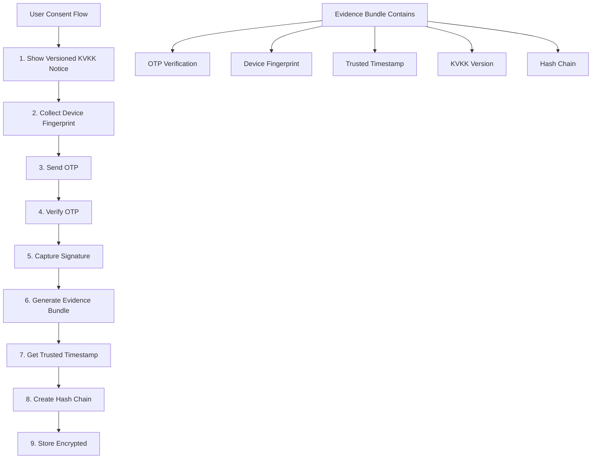

# SES + Evidence Implementation Plan for KVKK Compliance
**Approach:** Simple Electronic Signature with Strong Evidence Collection  
**Timeline:** 2 weeks for core implementation  
**Compliance Target:** KVKK Board expectations with defensible evidence chain

## Overview

This implementation creates a legally defensible consent system using SES (Simple Electronic Signature) enhanced with comprehensive evidence collection. This approach satisfies KVKK requirements while avoiding the complexity and cost of QES integration.

---

## Architecture Overview



---

## Component 1: KVKK Notice Versioning System

### Implementation
```javascript
// File: backend/services/kvkkVersionService.js
class KVKKVersionService {
    constructor() {
        this.versions = new Map();
        this.currentVersion = null;
    }
    
    async createVersion(content, metadata) {
        const version = {
            id: `kvkk_v${metadata.version}_${new Date().toISOString().split('T')[0]}`,
            version: metadata.version,
            content: content,
            contentHash: crypto.createHash('sha256').update(content).digest('hex'),
            effectiveDate: new Date().toISOString(),
            changes: metadata.changes || [],
            approvedBy: metadata.approvedBy,
            filePath: `./notices/kvkk_v${metadata.version}.html`
        };
        
        // Store version
        await this.storeVersion(version);
        this.versions.set(version.id, version);
        this.currentVersion = version.id;
        
        return version;
    }
    
    async getVersionForConsent(consentDate) {
        // Return the version that was effective at consent time
        const versions = Array.from(this.versions.values());
        return versions
            .filter(v => new Date(v.effectiveDate) <= new Date(consentDate))
            .sort((a, b) => new Date(b.effectiveDate) - new Date(a.effectiveDate))[0];
    }
}
```

### Database Schema
```sql
CREATE TABLE kvkk_versions (
    id VARCHAR(50) PRIMARY KEY,
    version VARCHAR(10) NOT NULL,
    content TEXT NOT NULL,
    content_hash VARCHAR(64) NOT NULL,
    effective_date TIMESTAMP NOT NULL,
    changes JSONB,
    approved_by VARCHAR(100),
    created_at TIMESTAMP DEFAULT CURRENT_TIMESTAMP
);

CREATE INDEX idx_kvkk_versions_effective ON kvkk_versions(effective_date DESC);
```

---

## Component 2: OTP Verification System

### Implementation
```javascript
// File: backend/services/otpService.js
class OTPService {
    constructor() {
        this.otpStore = new Map(); // Use Redis in production
        this.ttl = 5 * 60 * 1000; // 5 minutes
    }
    
    async generateOTP(email, purpose = 'kvkk_consent') {
        // Generate 6-digit code
        const code = crypto.randomInt(100000, 999999).toString();
        const otpId = uuidv4();
        
        const otpData = {
            id: otpId,
            code: code,
            email: email,
            purpose: purpose,
            attempts: 0,
            maxAttempts: 3,
            createdAt: new Date().toISOString(),
            expiresAt: new Date(Date.now() + this.ttl).toISOString(),
            ipAddress: null, // Set when verified
            userAgent: null  // Set when verified
        };
        
        // Store OTP
        this.otpStore.set(otpId, otpData);
        
        // Send OTP via email
        await this.sendOTPEmail(email, code, purpose);
        
        // Log OTP generation (without the code)
        await this.logOTPEvent('generated', {
            otpId,
            email,
            purpose,
            expiresAt: otpData.expiresAt
        });
        
        return { otpId, expiresAt: otpData.expiresAt };
    }
    
    async verifyOTP(otpId, code, requestInfo) {
        const otpData = this.otpStore.get(otpId);
        
        if (!otpData) {
            throw new Error('OTP not found or expired');
        }
        
        // Check expiry
        if (new Date() > new Date(otpData.expiresAt)) {
            this.otpStore.delete(otpId);
            throw new Error('OTP expired');
        }
        
        // Check attempts
        otpData.attempts++;
        if (otpData.attempts > otpData.maxAttempts) {
            this.otpStore.delete(otpId);
            throw new Error('Maximum attempts exceeded');
        }
        
        // Verify code
        if (otpData.code !== code) {
            this.otpStore.set(otpId, otpData);
            throw new Error('Invalid OTP code');
        }
        
        // Success - capture verification info
        const verificationResult = {
            otpId: otpData.id,
            email: otpData.email,
            purpose: otpData.purpose,
            verifiedAt: new Date().toISOString(),
            ipAddress: requestInfo.ip,
            userAgent: requestInfo.userAgent,
            attempts: otpData.attempts
        };
        
        // Delete used OTP
        this.otpStore.delete(otpId);
        
        // Log verification
        await this.logOTPEvent('verified', verificationResult);
        
        return verificationResult;
    }
    
    async sendOTPEmail(email, code, purpose) {
        const template = `
            <h2>KVKK Onay Doğrulama Kodu</h2>
            <p>Sayın Kullanıcı,</p>
            <p>KVKK onay işleminizi tamamlamak için doğrulama kodunuz:</p>
            <h1 style="font-size: 32px; letter-spacing: 5px; color: #007bff;">${code}</h1>
            <p>Bu kod 5 dakika içinde geçerliliğini yitirecektir.</p>
            <p>Bu işlemi siz yapmadıysanız, lütfen bu e-postayı dikkate almayın.</p>
        `;
        
        await emailService.sendMail({
            to: email,
            subject: 'KVKK Onay Doğrulama Kodu',
            html: template
        });
    }
}
```

---

## Component 3: Device Fingerprinting

### Frontend Collection
```javascript
// File: src/js/utils/deviceFingerprint.js
class DeviceFingerprint {
    static async collect() {
        const fingerprint = {
            // Screen information
            screenResolution: `${screen.width}x${screen.height}`,
            screenColorDepth: screen.colorDepth,
            screenPixelRatio: window.devicePixelRatio,
            
            // Timezone
            timezone: Intl.DateTimeFormat().resolvedOptions().timeZone,
            timezoneOffset: new Date().getTimezoneOffset(),
            
            // Language
            language: navigator.language,
            languages: navigator.languages,
            
            // Platform
            platform: navigator.platform,
            userAgent: navigator.userAgent,
            
            // Hardware
            hardwareConcurrency: navigator.hardwareConcurrency,
            deviceMemory: navigator.deviceMemory,
            
            // Canvas fingerprint (optional - heavier)
            canvasFingerprint: await this.getCanvasFingerprint(),
            
            // WebGL info
            webglVendor: this.getWebGLVendor(),
            webglRenderer: this.getWebGLRenderer(),
            
            // Collection timestamp
            collectedAt: new Date().toISOString()
        };
        
        // Generate hash of fingerprint
        fingerprint.hash = await this.hashFingerprint(fingerprint);
        
        return fingerprint;
    }
    
    static async hashFingerprint(fingerprint) {
        // Create stable string representation
        const stable = JSON.stringify({
            screen: fingerprint.screenResolution,
            timezone: fingerprint.timezone,
            platform: fingerprint.platform,
            ua: fingerprint.userAgent
        });
        
        // Generate SHA-256 hash
        const encoder = new TextEncoder();
        const data = encoder.encode(stable);
        const hashBuffer = await crypto.subtle.digest('SHA-256', data);
        const hashArray = Array.from(new Uint8Array(hashBuffer));
        return hashArray.map(b => b.toString(16).padStart(2, '0')).join('');
    }
    
    static async getCanvasFingerprint() {
        const canvas = document.createElement('canvas');
        const ctx = canvas.getContext('2d');
        canvas.width = 200;
        canvas.height = 50;
        
        // Draw test text
        ctx.textBaseline = 'top';
        ctx.font = '14px Arial';
        ctx.fillText('KVKK Consent 🔒', 10, 10);
        
        return canvas.toDataURL();
    }
}
```

---

## Component 4: Trusted Timestamp Integration

### Implementation
```javascript
// File: backend/services/timestampService.js
class TrustedTimestampService {
    constructor() {
        // TÜBİTAK Kamu-SM test endpoint (replace with production)
        this.tsaUrl = process.env.TSA_URL || 'http://tzd.kamusm.gov.tr';
        this.hashAlgorithm = 'sha256';
    }
    
    async getTimestamp(dataHash) {
        try {
            // Create timestamp request (RFC 3161)
            const tsRequest = await this.createTimestampRequest(dataHash);
            
            // Send to TSA
            const response = await fetch(this.tsaUrl, {
                method: 'POST',
                headers: {
                    'Content-Type': 'application/timestamp-query',
                    'Content-Length': tsRequest.length
                },
                body: tsRequest
            });
            
            if (!response.ok) {
                throw new Error(`TSA request failed: ${response.status}`);
            }
            
            const tsResponse = await response.arrayBuffer();
            
            // Parse and verify response
            const timestamp = await this.parseTimestampResponse(tsResponse);
            
            return {
                timestamp: timestamp.genTime,
                serialNumber: timestamp.serialNumber,
                hash: dataHash,
                tsaName: timestamp.tsaName,
                algorithm: this.hashAlgorithm,
                token: Buffer.from(tsResponse).toString('base64')
            };
            
        } catch (error) {
            console.error('Timestamp service error:', error);
            // Fallback to local timestamp with warning
            return {
                timestamp: new Date().toISOString(),
                warning: 'TSA unavailable, using local timestamp',
                hash: dataHash,
                algorithm: this.hashAlgorithm
            };
        }
    }
    
    async createTimestampRequest(hash) {
        // Simplified - use node-forge or similar for production
        const asn1 = require('node-forge').asn1;
        const request = {
            version: 1,
            messageImprint: {
                hashAlgorithm: this.hashAlgorithm,
                hashedMessage: hash
            },
            reqPolicy: null,
            nonce: crypto.randomBytes(8).toString('hex'),
            certReq: true
        };
        
        return this.encodeTimestampRequest(request);
    }
}
```

---

## Component 5: Hash Chain Implementation

### Implementation
```javascript
// File: backend/services/hashChainService.js
class HashChainService {
    constructor() {
        this.chainStore = new Map(); // Use database in production
    }
    
    async createChainedRecord(consentData, previousHash = null) {
        // If no previous hash, this is the genesis block
        if (!previousHash) {
            const lastRecord = await this.getLastRecord();
            previousHash = lastRecord ? lastRecord.chainHash : '0'.repeat(64);
        }
        
        // Create record with all evidence
        const record = {
            id: uuidv4(),
            timestamp: new Date().toISOString(),
            consentData: consentData,
            previousHash: previousHash,
            nonce: crypto.randomBytes(16).toString('hex')
        };
        
        // Calculate chain hash
        record.chainHash = this.calculateChainHash(record);
        
        // Store record
        await this.storeRecord(record);
        
        return {
            recordId: record.id,
            chainHash: record.chainHash,
            previousHash: record.previousHash,
            timestamp: record.timestamp
        };
    }
    
    calculateChainHash(record) {
        // Create deterministic string representation
        const chainData = {
            previousHash: record.previousHash,
            timestamp: record.timestamp,
            consentId: record.consentData.id,
            evidenceHash: crypto.createHash('sha256')
                .update(JSON.stringify(record.consentData))
                .digest('hex'),
            nonce: record.nonce
        };
        
        return crypto.createHash('sha256')
            .update(JSON.stringify(chainData))
            .digest('hex');
    }
    
    async verifyChain(fromId = null) {
        const records = await this.getAllRecords(fromId);
        let previousHash = fromId ? (await this.getRecord(fromId)).previousHash : '0'.repeat(64);
        
        for (const record of records) {
            // Verify previous hash matches
            if (record.previousHash !== previousHash) {
                return {
                    valid: false,
                    brokenAt: record.id,
                    reason: 'Previous hash mismatch'
                };
            }
            
            // Verify chain hash
            const calculatedHash = this.calculateChainHash(record);
            if (record.chainHash !== calculatedHash) {
                return {
                    valid: false,
                    brokenAt: record.id,
                    reason: 'Chain hash mismatch'
                };
            }
            
            previousHash = record.chainHash;
        }
        
        return {
            valid: true,
            recordsVerified: records.length,
            lastHash: previousHash
        };
    }
}
```

---

## Component 6: Evidence Bundle Assembly

### Implementation
```javascript
// File: backend/services/evidenceBundleService.js
class EvidenceBundleService {
    constructor() {
        this.otpService = new OTPService();
        this.timestampService = new TrustedTimestampService();
        this.hashChainService = new HashChainService();
        this.kvkkVersionService = new KVKKVersionService();
    }
    
    async createEvidenceBundle(consentData, otpVerification, deviceFingerprint, signatureData) {
        // Step 1: Get KVKK version info
        const kvkkVersion = await this.kvkkVersionService.getCurrentVersion();
        
        // Step 2: Separate notice acknowledgment from consent
        const noticeAck = {
            type: 'aydınlatma_metni',
            version: kvkkVersion.id,
            acknowledgedAt: consentData.noticeAcknowledgedAt,
            hash: kvkkVersion.contentHash
        };
        
        const explicitConsent = {
            type: 'açık_rıza',
            version: kvkkVersion.id,
            consentedAt: consentData.consentedAt,
            scope: consentData.scope
        };
        
        // Step 3: Create evidence bundle
        const evidenceBundle = {
            bundleId: uuidv4(),
            createdAt: new Date().toISOString(),
            
            // Consent information
            consent: {
                patientName: consentData.patientName,
                email: consentData.email,
                role: consentData.role,
                noticeAcknowledgment: noticeAck,
                explicitConsent: explicitConsent
            },
            
            // OTP verification evidence
            otpEvidence: {
                verificationId: otpVerification.otpId,
                verifiedAt: otpVerification.verifiedAt,
                email: otpVerification.email,
                ipAddress: otpVerification.ipAddress,
                attempts: otpVerification.attempts
            },
            
            // Device fingerprint
            deviceEvidence: {
                fingerprintHash: deviceFingerprint.hash,
                screenResolution: deviceFingerprint.screenResolution,
                timezone: deviceFingerprint.timezone,
                platform: deviceFingerprint.platform,
                userAgent: deviceFingerprint.userAgent,
                collectedAt: deviceFingerprint.collectedAt
            },
            
            // Signature data
            signatureEvidence: {
                signatureDataUrl: signatureData.dataURL,
                signatureHash: crypto.createHash('sha256')
                    .update(signatureData.dataURL)
                    .digest('hex'),
                signedAt: signatureData.timestamp,
                canvasSize: signatureData.canvasSize
            },
            
            // PDF information
            documentEvidence: {
                pdfHash: consentData.pdfHash,
                pdfSize: consentData.pdfSize,
                generatedAt: consentData.pdfGeneratedAt
            }
        };
        
        // Step 4: Calculate bundle hash
        evidenceBundle.bundleHash = crypto.createHash('sha256')
            .update(JSON.stringify(evidenceBundle))
            .digest('hex');
        
        // Step 5: Get trusted timestamp
        const timestamp = await this.timestampService.getTimestamp(evidenceBundle.bundleHash);
        evidenceBundle.trustedTimestamp = timestamp;
        
        // Step 6: Add to hash chain
        const chainRecord = await this.hashChainService.createChainedRecord(evidenceBundle);
        evidenceBundle.chainInfo = chainRecord;
        
        // Step 7: Encrypt and store
        const encryptedBundle = await this.encryptBundle(evidenceBundle);
        await this.storeBundle(encryptedBundle);
        
        return {
            bundleId: evidenceBundle.bundleId,
            bundleHash: evidenceBundle.bundleHash,
            chainHash: chainRecord.chainHash,
            timestamp: timestamp.timestamp,
            stored: true
        };
    }
    
    async encryptBundle(bundle) {
        // Use existing encryption service
        return encryptionService.encrypt(
            JSON.stringify(bundle),
            `evidence:${bundle.bundleId}`
        );
    }
}
```

---

## Integration Flow

### Frontend Integration
```javascript
// File: src/js/components/enhancedConsent.js
class EnhancedConsentFlow {
    async collectConsent(formData) {
        try {
            // Step 1: Show versioned KVKK notice
            const kvkkVersion = await this.showVersionedNotice();
            formData.noticeAcknowledgedAt = new Date().toISOString();
            
            // Step 2: Collect device fingerprint
            const deviceFingerprint = await DeviceFingerprint.collect();
            
            // Step 3: Request OTP
            const { otpId } = await apiClient.requestOTP(formData.email);
            
            // Step 4: Show OTP input and verify
            const otpCode = await this.showOTPInput();
            const otpVerification = await apiClient.verifyOTP(otpId, otpCode);
            
            // Step 5: Collect signature
            const signatureData = await this.collectSignature();
            formData.consentedAt = new Date().toISOString();
            
            // Step 6: Generate PDF with all evidence
            const pdfData = await this.generateEnhancedPDF(
                formData, 
                signatureData, 
                deviceFingerprint,
                otpVerification
            );
            
            // Step 7: Submit with evidence bundle
            const result = await apiClient.submitConsentWithEvidence({
                formData,
                otpVerification,
                deviceFingerprint,
                signatureData,
                pdfData,
                kvkkVersion
            });
            
            return result;
            
        } catch (error) {
            console.error('Enhanced consent flow error:', error);
            throw error;
        }
    }
}
```

---

## Database Schema Updates

```sql
-- Evidence bundles table
CREATE TABLE evidence_bundles (
    id UUID PRIMARY KEY,
    bundle_hash VARCHAR(64) NOT NULL,
    chain_hash VARCHAR(64) NOT NULL,
    previous_hash VARCHAR(64) NOT NULL,
    encrypted_data TEXT NOT NULL,
    trusted_timestamp JSONB,
    created_at TIMESTAMP DEFAULT CURRENT_TIMESTAMP,
    
    CONSTRAINT unique_chain_hash UNIQUE (chain_hash)
);

-- OTP logs table
CREATE TABLE otp_logs (
    id UUID PRIMARY KEY,
    email VARCHAR(255) NOT NULL,
    purpose VARCHAR(50) NOT NULL,
    event_type VARCHAR(20) NOT NULL,
    event_data JSONB,
    ip_address INET,
    created_at TIMESTAMP DEFAULT CURRENT_TIMESTAMP
);

-- Chain integrity table
CREATE TABLE hash_chain (
    id UUID PRIMARY KEY,
    record_type VARCHAR(50) NOT NULL,
    record_id UUID NOT NULL,
    previous_hash VARCHAR(64) NOT NULL,
    chain_hash VARCHAR(64) NOT NULL,
    created_at TIMESTAMP DEFAULT CURRENT_TIMESTAMP,
    
    CONSTRAINT unique_chain_entry UNIQUE (chain_hash)
);

-- Indexes
CREATE INDEX idx_evidence_bundles_created ON evidence_bundles(created_at DESC);
CREATE INDEX idx_otp_logs_email ON otp_logs(email, created_at DESC);
CREATE INDEX idx_hash_chain_previous ON hash_chain(previous_hash);
```

---

## Security Considerations

### 1. Clock Synchronization
```bash
# Ensure NTP is configured
sudo apt-get install ntp
sudo systemctl enable ntp
sudo systemctl start ntp

# Verify time sync
ntpq -p
```

### 2. Evidence Retention
```javascript
// Quarterly retention job
async function retentionCleanup() {
    const retentionPeriod = 20 * 365 * 24 * 60 * 60 * 1000; // 20 years
    const cutoffDate = new Date(Date.now() - retentionPeriod);
    
    // Check for litigation holds
    const holds = await getLitigationHolds();
    
    // Delete expired records not under hold
    const deleted = await evidenceBundleService.deleteExpiredBundles(cutoffDate, holds);
    
    // Log deletion
    await auditLog.record('retention_cleanup', {
        cutoffDate,
        deletedCount: deleted.count,
        retainedUnderHold: holds.length
    });
}
```

### 3. Backup Considerations
- Evidence bundles should be included in encrypted backups
- Hash chain must be backed up atomically
- Test restoration quarterly

---

## Testing Checklist

### Unit Tests
- [ ] OTP generation and expiry
- [ ] Device fingerprint stability
- [ ] Hash chain integrity
- [ ] Timestamp verification
- [ ] Evidence bundle encryption

### Integration Tests
- [ ] Complete consent flow
- [ ] OTP timeout handling
- [ ] Chain verification after 1000 records
- [ ] Concurrent consent handling
- [ ] Evidence retrieval and decryption

### Compliance Tests
- [ ] Two-click separation (notice vs consent)
- [ ] Version tracking accuracy
- [ ] Evidence completeness
- [ ] Audit trail integrity
- [ ] Retention policy enforcement

---

## Deployment Steps

1. **Database Migration**
   ```bash
   npm run migrate:evidence-tables
   ```

2. **Environment Configuration**
   ```env
   # OTP Settings
   OTP_TTL_MINUTES=5
   OTP_MAX_ATTEMPTS=3
   
   # TSA Settings
   TSA_URL=http://tzd.kamusm.gov.tr
   TSA_TIMEOUT=10000
   
   # Evidence Settings
   EVIDENCE_ENCRYPTION_KEY=${ENCRYPTION_KEY}
   CHAIN_GENESIS_HASH=0000000000000000000000000000000000000000000000000000000000000000
   ```

3. **Service Initialization**
   ```javascript
   // Add to server startup
   await kvkkVersionService.initialize();
   await hashChainService.verifyIntegrity();
   await timestampService.testConnection();
   ```

---

## Monitoring and Alerts

### Key Metrics
- OTP verification success rate
- Average consent completion time
- TSA availability
- Chain verification status
- Evidence bundle size

### Alert Conditions
- OTP service failure rate > 5%
- TSA unavailable > 5 minutes
- Chain integrity check failure
- Evidence encryption failure
- Abnormal consent patterns

---

## Legal Documentation Updates

### DPIA Addition
```markdown
## Simple Electronic Signature Risk Assessment

**Risk**: SES may be challenged as insufficient for health data consent
**Likelihood**: Medium
**Impact**: High

**Mitigations Implemented**:
1. OTP verification provides identity assurance
2. Device fingerprinting prevents repudiation
3. Trusted timestamps prove timing
4. Hash chain ensures tamper-evidence
5. Comprehensive evidence bundle exceeds typical SES requirements

**Residual Risk**: Low - Evidence package provides court-defensible proof
```

### Update Privacy Notice
- Explain OTP verification process
- Describe device information collection
- Note trusted timestamp usage
- Clarify evidence retention period

---

## Cost Analysis

### One-Time Costs
- Development: 2 weeks @ €5,000
- Security review: €1,000
- Legal review: €500

### Recurring Costs
- TSA service: ~€50/month (for 10,000 timestamps)
- SMS OTP: ~€0.05 per consent
- Additional storage: ~€10/month

### Total First Year: ~€7,500

---

## Conclusion

This SES + Evidence implementation provides KVKK-compliant consent management without the complexity of QES. The evidence bundle creates a tamper-evident, time-stamped, identity-verified record that exceeds typical SES implementations and satisfies KVKK Board expectations.

Key advantages:
- No dependency on QES providers
- Lower cost and complexity
- Faster implementation
- Upgrade path to QES remains open
- Exceeds standard SES evidence requirements

The system can be implemented in 2 weeks with proper testing and provides a legally defensible consent mechanism for health data processing under KVKK.